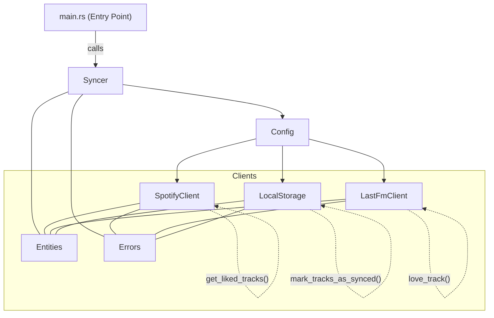

Rsyncer - a rust implementation of Track likes syncer

### Warning
> This tool relies on "lastfm-rust" library which is not not production ready: it prints debug information to stdout and doesn't handle errors properly. Use at your own risk.

### Code composition




### Envs vars

```
# As env variables:
export RSPOTIFY_CLIENT_ID=your_spotify_client_id
export RSPOTIFY_CLIENT_SECRET=your_spotify_client_secret
export RSPOTIFY_REDIRECT_URI=http://127.0.0.1:8888/callback
export LASTFM_API_KEY=your_lastfm_api_key
export LASTFM_API_SECRET=your_lastfm_api_secret
export RUST_LOG=info

# or in a .env file:
export ENV_FILE_PATH=.path/to/your/.env
```


### CLI

```sh
# dev mode
cargo run
# release mode
rsyncer sync
```

### Tests

```sh
cargo test
# with coverage
cargo llvm-cov --summary-only
```

### Code formatting and linting
```sh
# 1. Format code
cargo fmt

# 2. Run clippy and fix auto-fixable issues
cargo clippy --fix --allow-dirty

# 3. Run clippy again to see remaining issues
cargo clippy --all-targets -- -D warnings
```


### Bump version

```sh
cargo install cargo-edit
cargo set-version --bump minor
```
