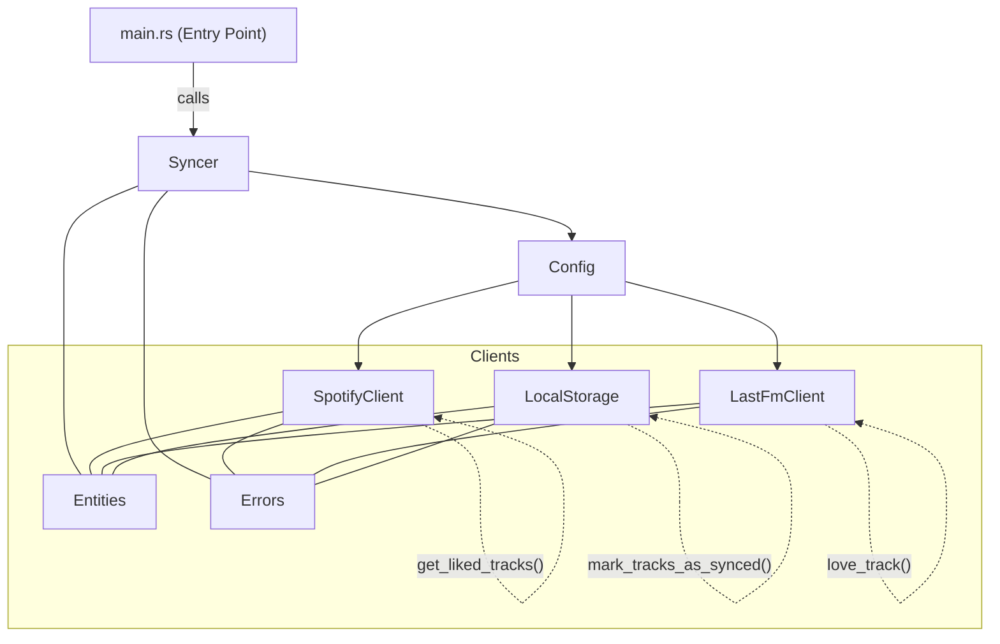

Rsyncer - a rust implementation of Track likes syncer

### Warning
> This tool relies on "lastfm-rust" library which is not not production ready: it prints debug information to stdout and doesn't handle errors properly. Use at your own risk.

### Code composition




### Envs vars

```
export SPOTIFY_CLIENT_ID=your_spotify_client_id
export SPOTIFY_CLIENT_SECRET=your_spotify_client_secret
export SPOTIFY_REDIRECT_URI=your_spotify_redirect_uri
export LASTFM_API_KEY=your_lastfm_api_key
export LASTFM_API_SECRET=your_lastfm_api_secret
export RUST_LOG=info
```


### CLI

```sh
cargo run
```

### Tests

```rust
todo!()
```