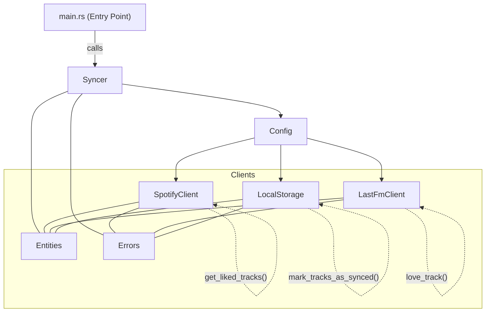

Rsyncer - a rust implementation of Track likes syncer

### Warning
> This tool relies on "lastfm-rust" library which is not not production ready: it prints debug information to stdout and doesn't handle errors properly. Use at your own risk.

### Code composition


```mermaid
flowchart TD
    A["main.rs (Entry Point)"] -->|calls| B[Syncer]
    B --> C[Config]
    C --> D[SpotifyClient]
    C --> E[LastFmClient]
    C --> F[LocalStorage]

    subgraph Clients
        D
        E
        F
        G[Entities]
        H[Errors]
    end

    D -.->|"get_liked_tracks()"| D
    F -.->|"get_synced_tracks()"| F
    F -.->|"mark_tracks_as_synced()"| F
    E -.->|"track_exists()"| E
    E -.->|"love_track()"| E

    B --- G
    B --- H
    D --- G
    D --- H
    E --- G
    E --- H
    F --- G
    F --- H
```


### Envs vars

```
# As env variables:
export RSPOTIFY_CLIENT_ID=your_spotify_client_id
export RSPOTIFY_CLIENT_SECRET=your_spotify_client_secret
export RSPOTIFY_REDIRECT_URI=http://127.0.0.1:8888/callback
export LASTFM_API_KEY=your_lastfm_api_key
export LASTFM_API_SECRET=your_lastfm_api_secret
export RUST_LOG=info

# or in a .env file:
export ENV_FILE_PATH=.path/to/your/.env
```


### CLI

```sh
# dev mode (requires cli feature for DuckDB)
cargo run --features cli

# release mode
cargo build --release --features cli
./target/release/rsyncer sync
```

### Tests

```sh
cargo test --features cli
# with coverage
cargo llvm-cov --summary-only --features cli
```

### Code formatting and linting
```sh
# 1. Format code
cargo fmt

# 2. Run clippy and fix auto-fixable issues
cargo clippy --fix --allow-dirty

# 3. Run clippy again to see remaining issues
cargo clippy --all-targets -- -D warnings
```


### Bump version

```sh
# cargo install cargo-edit
cargo set-version --bump minor
```


# HTTP API

The project includes a simple HTTP API (`http_api`) for deployment to Cloud Run.

**Note:** The HTTP API is built without the `cli` feature, which excludes DuckDB and other CLI-only dependencies. This results in faster builds and smaller binary size.

### Endpoints
- `GET /` - Hello world
- `GET /health` - Health check with version info

### Local Development
```sh
cargo run --bin http_api
# Then: curl http://localhost:8080/health
```

## Docker Build

### Local Docker Build
```sh
VERSION=$(grep '^version' Cargo.toml | head -1 | sed 's/.*"\(.*\)".*/\1/')
docker build --build-arg VERSION=$VERSION -t rsyncer-api:$VERSION .

# Run locally
docker run -p 8080:8080 rsyncer-api:$VERSION
```

## Cloud Deployment

**Prerequisites:** Run `terraform apply` first to create the Artifact Registry repository and enable required APIs.

### Build with Cloud Build
```sh
gcloud builds submit --config=cloudbuild.yaml .
```
